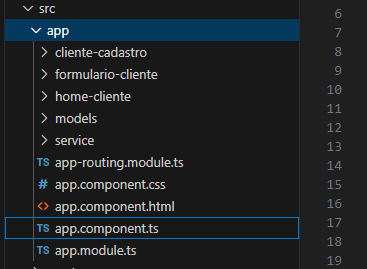
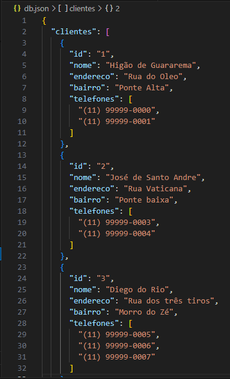
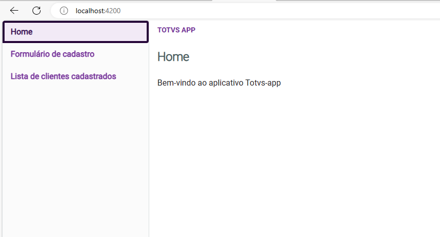
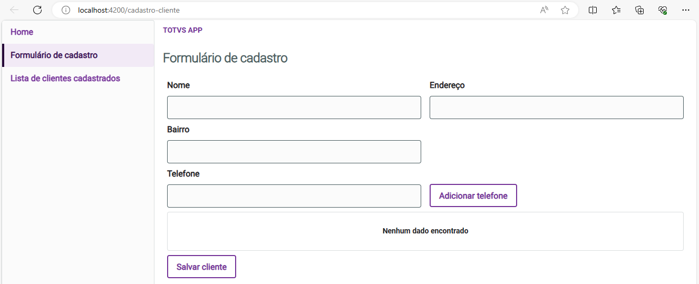
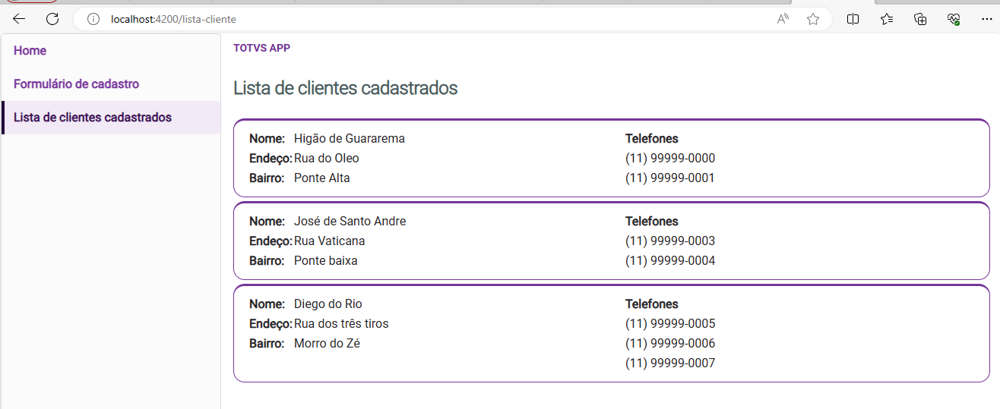

# Projeto [Angular CLI](https://github.com/angular/angular-cli) versão 16.2.12.

Cadastro de clientes com telefones

## 🚀 Início.

O objetivo principal do projeto é unir diversas tecnologias em uma aplicação front-end

## 🛠 Stack.

<ol>
  <li>Angular 16</li>
  <li>po-ui</li>
  <li>Json-server</li>
  <li>Html</li>
  <li>Css</li>
  <li>TypeScript</li>
</ol>

## ⚙️ Structure.

## ⚙️ Serviço para testes com Json-server.

O Json-server faz um simulação de um serviços para testes no front-end

## ⚙️ Executando o projeto.

~~~~shell
 json-server --watch db.json # Inicia o serviço json-server
 npm i -g @angular/cli@16    # Instala o Angular CLI 16
 npm install                 # Instala as dependência dentro do projeto
 ng serve --open             # Inicia a aplicação, com o --open a aplicação vai abrir no navegador
~~~~

## 🖥️ Telas do sistema - [Home](http://localhost:4200/).

## 🖥️ Telas do sistema - [Formulário de cadastro](http://localhost:4200/cadastro-cliente).

## 🖥️ Telas do sistema - [Lista de clientes cadastrados](http://localhost:4200/lista-cliente).

## ✒️ Autor.

Higor Roberto - higorroberto.dev@gmail.com